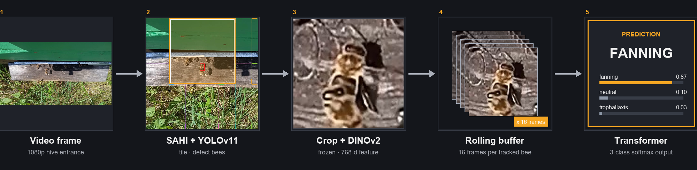

# Investigation of Deep Learning Methods for Bee Behavior Recognition

A two-stage computer vision pipeline that detects individual honey bees at the hive entrance and classifies their behavior — **fanning, trophallaxis,** or **neutral** — from a rolling 16-frame buffer of per-bee crops.

Master's thesis, [Vilnius Gediminas Technical University (VILNIUS TECH / VGTU)](https://vilniustech.lt), defended **25 May 2026** (grade: 10/10).



---

## Headline Results

| Stage | Model | Metric | Value |
|---|---|---|---|
| Detection | YOLOv11-medium + SAHI tiling | **mAP@0.5** | **0.992** |
| Detection | YOLOv11-medium + SAHI tiling | **mAP@0.5:0.95** | **0.853** |
| Detection | YOLOv11-medium + SAHI tiling | Precision / Recall | 0.983 / 0.973 |
| Action recognition | Temporal Transformer (3 layers, 6 heads) on frozen DINOv2-small features, 16-frame buffer | **Accuracy** | **0.97** |
| Action recognition | — | **Macro F1** | **0.96** |

**Per-class F1** (validation, 44,680 samples): fanning **0.97** · neutral **0.97** · trophallaxis **0.95**.

Relative to the prior YOLOv8-medium baseline used in earlier VGTU bee-monitoring work, this pipeline delivers a **31% improvement in mAP@0.5:0.95** and — to the best of the author's knowledge — the **first individual-level trophallaxis recognition from video** in the bee-monitoring literature.

End-to-end demo (44,680 frames across three source datasets): see [E2E/end_to_end_output.mp4](E2E/end_to_end_output.mp4).

---

## Quick Start

```bash
git clone https://github.com/ImAnurath/Masters.git
cd Masters
pip install -r requirements.txt   # see "Environment" below
```

Run inference end-to-end on a video using the provided weights:

```python
# See E2E/end_to_end.ipynb for the full pipeline
from ultralytics import YOLO
det = YOLO("Trained_Models/DET_medium-best.pt")
# AR model: Trained_Models/ACT_best.pt  (3-layer temporal Transformer, buf=16, 768-d DINOv2 features)
```

Pretrained weights ship in [Trained_Models/](Trained_Models/):

- [`DET_medium-best.pt`](Trained_Models/DET_medium-best.pt) — YOLOv11-m bee detector (~40 MB)
- [`ACT_best.pt`](Trained_Models/ACT_best.pt) — temporal Transformer classifier (~58 MB)

---

## Pipeline

### Stage 1 — Detection

- **Model:** YOLOv11-medium, single class (`bee`)
- **Preprocessing:** Slicing Aided Hyper Inference (SAHI) — input frames are split into overlapping 640×640 tiles to preserve resolution for small bees
- **Training data pipeline:** [Data/DET_data_OG/](Data/DET_data_OG/) (raw frames) → [Utilities/tiling.py](Utilities/tiling.py) → [Data/DET_data_sliced/](Data/DET_data_sliced/) (640×640 overlapping tiles) → [Utilities/data_split.py](Utilities/data_split.py) → [Data/DET_data_sliced_split/](Data/DET_data_sliced_split/) (train/val split, **30,001 images**)
- **Optimizer:** AdamW; **best epoch:** 238
- **Notebook:** [Detection/Detection_training.ipynb](Detection/Detection_training.ipynb)
- **Best run:** [Detection/runs/detect/yolo11m-medium-spec_AdamW/](Detection/runs/detect/yolo11m-medium-spec_AdamW/)

### Tracking

- **ByteTrack** assigns persistent identities across frames, producing per-bee temporal sequences for stage 2.

### Stage 2 — Action Recognition

- **Feature extractor:** [DINOv2-small](https://github.com/facebookresearch/dinov2) (frozen), producing 768-dim features (CLS ⊕ mean patch token) per crop.
- **Classifier:** 3-layer Transformer encoder, 6 heads, dropout 0.35.
- **Buffer:** 16 frames (buf16 outperformed buf8).
- **Training tricks:** label smoothing (0.1), mixup (p=0.5, α=0.6), R-Drop (w=0.2), entropy regularization (w=0.05), feature-space augmentation (Gaussian noise, temporal jitter, frame drop).
- **Best epoch:** 27 (early stopping; val F1 = 0.9638).
- **Notebooks:** [ActionRecognition/data_prep.ipynb](ActionRecognition/data_prep.ipynb), [ActionRecognition/train.ipynb](ActionRecognition/train.ipynb).
- **Best run artifacts:** [ActionRecognition/20260509_055348/](ActionRecognition/20260509_055348/) (config, confusion matrix, learning curves, classification report).

### End-to-End

[E2E/end_to_end.ipynb](E2E/end_to_end.ipynb) runs the full pipeline (detection → tracking → feature extraction → temporal classification) over an input video and writes an annotated output (see [E2E/end_to_end_output.mp4](E2E/end_to_end_output.mp4)).

---

## Repository Structure

```
Masters/
├── Detection/                  YOLOv11 detection stage
│   ├── Detection_training.ipynb
│   ├── BaseModels/             Pretrained YOLO weights (yolo11n/s/m.pt)
│   ├── YAMLs/                  Training configs (dataset, augmentation, hyperparams)
│   └── runs/detect/            Training run outputs (best: yolo11m-medium-spec_AdamW)
│
├── ActionRecognition/          Temporal Transformer stage
│   ├── data_prep.ipynb / .py   Feature pre-computation (DINOv2)
│   ├── train.ipynb / .py       Classifier training
│   ├── 20260509_055348/        Best run: weights + curves + report
│   └── results/                E2E inference outputs and per-graph CSV
│
├── E2E/                        End-to-end pipeline + demo videos
│
├── Data/
│   ├── DET_data_OG/            Raw detection frames (single class: bee) — source
│   ├── DET_data_sliced/        Output of Utilities/tiling.py (overlapping tiles)
│   ├── DET_data_sliced_split/  Output of Utilities/data_split.py — used for training
│   ├── AR_dataset/             Raw AR clips (fanning, trophallaxis)
│   └── AR_merged_dataset/      Final AR dataset with neutral class
│
├── Trained_Models/             Final saved weights (DET + AR)
│
├── Utilities/
│   ├── tiling.py               Image tiling for detection data prep
│   └── data_split.py           Train/val splitting utility
│
├── Graphs/                     Result plotting notebooks
│
└── Thesis/                     Final PDF, defense slides, pipeline diagram
```

---

## Dataset

The bee behavior data is split into three publicly released archives:

- **Detection** — 30,001 tiled images, single class `bee`: [Link TBD]
- **Action recognition · Fanning** — labeled per-bee clips of fanning behavior: [Link TBD]
- **Action recognition · Trophallaxis** — labeled per-bee clips of trophallaxis: [Link TBD]

The `neutral` class used in training is constructed from unlabeled track segments in the fanning and trophallaxis source videos (see [ActionRecognition/data_prep.ipynb](ActionRecognition/data_prep.ipynb)).

Pretrained weights in [Trained_Models/](Trained_Models/) are sufficient to reproduce the end-to-end inference results on your own video without downloading the training data.

---

## Environment

Trained and tested with:

- Python 3.10+
- PyTorch (CUDA build matched to your GPU)
- [ultralytics](https://github.com/ultralytics/ultralytics) (YOLOv11)
- [sahi](https://github.com/obss/sahi) (tiling at inference)
- transformers (DINOv2)
- numpy, pandas, scikit-learn, matplotlib, opencv-python

See [requirements.txt](requirements.txt). Install a CUDA-matched PyTorch build from [pytorch.org](https://pytorch.org/get-started/locally/) **before** running `pip install -r requirements.txt`; the rest of the stack is CPU/CUDA agnostic.

---

## Thesis

The full thesis and defense materials are in [Thesis/](Thesis/):

- [OBG_FinalThesis.pdf](Thesis/OBG_FinalThesis.pdf) — final submitted manuscript
- [Defense_Presentation_Final.pptx](Thesis/Defense_Presentation_Final.pptx) — defense slides
- [pipeline_diagram_bee_9.png](Thesis/pipeline_diagram_bee_9.png) — pipeline figure

### Citation

The thesis manuscript is not yet published in an external repository — a public link (university repository / preprint) will be added here once available. In the meantime please cite as:

```bibtex
@mastersthesis{gultegin2026bee,
  title  = {Investigation of Deep Learning Methods for Bee Behavior Recognition},
  author = {G\"{u}ltegin, Ozan Berk},
  school = {Vilnius Gediminas Technical University (VILNIUS TECH)},
  year   = {2026},
  month  = {May},
  type   = {Master's thesis},
  note   = {Publication forthcoming; see Thesis/OBG_FinalThesis.pdf in repository},
  url    = {https://github.com/ImAnurath/Masters}
  % howpublished = {Forthcoming: <publication link TBD>}
}
```

---

## Author

**Ozan Berk Gültegin** — [github.com/ImAnurath](https://github.com/ImAnurath)

## License

[MIT](LICENSE) — code only. The thesis manuscript and figures in [Thesis/](Thesis/) are © 2026 Ozan Berk Gültegin, all rights reserved.
